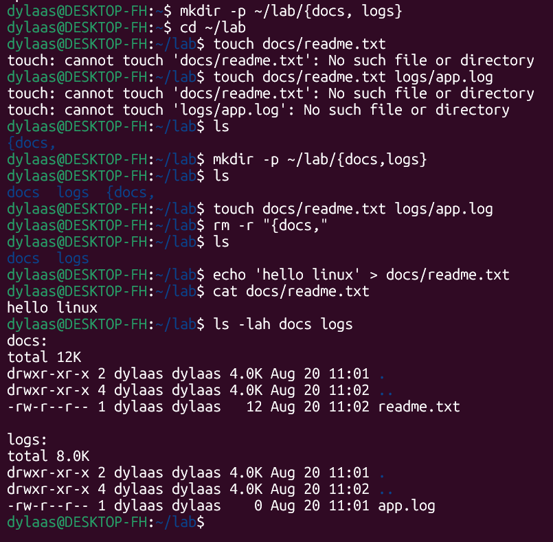
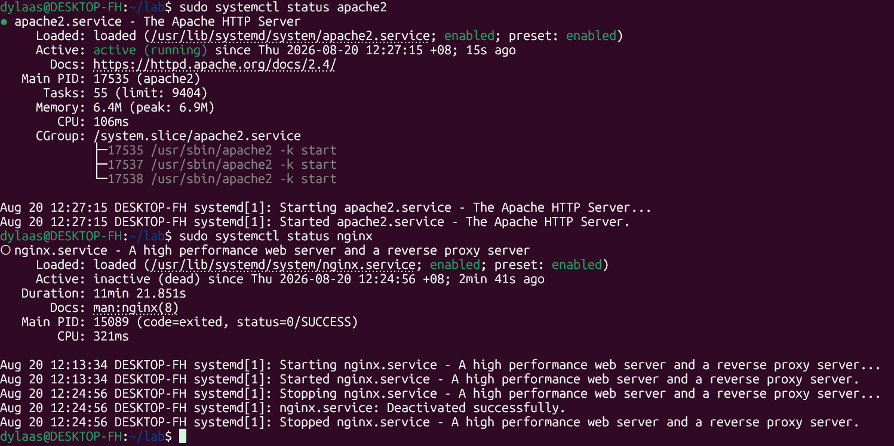

# AI Platform & Docker Setup Notes

## 1. Navigation & Directory Setup
* `cd ~` - Navigate to the home directory.
* `cd lab` - Move into the lab directory.
* `sudo mkdir -p /srv/ai-platform/{data,models,services}` - Create the main project folder and its necessary subdirectories in one command.
* `sudo chown -R dylaas:dylaas /srv/ai-platform` - Take ownership of the project folder so future commands don't require `sudo`.
* `cd /srv/ai-platform` - Move into the new working directory.

## 2. Docker Troubleshooting & Verification
* `docker --version` - Verified Docker is installed (v29.7.2).
* `docker compose version` - Verified Docker Compose is installed (v5.4.0).
* `sudo rm -rf /var/run/docker.sock` - Cleared the stale/broken Docker socket file.
* `docker context use default` - Forced the terminal to use the default Docker context.
* `groups | grep docker` - Verified the `dylaas` user is successfully a member of the `docker` group.
* `docker` and `docker compose` - Verified the CLI tools successfully load their help menus.

## 3. Container Execution
* `docker run --rm hello-world` - Successfully pulled the image from Docker Hub, ran the test container, and verified the engine connection is working perfectly.

## 4. Project Configuration (.env Setup)
* `touch .env` - Created the hidden environment variables file.
* `vi .env` - Opened the file in the Vim text editor.
  * **Vim Workflow used:**
    1. Pressed `i` to enter Insert Mode.
    2. Pasted the necessary environment variable content.
    3. Pressed `Esc` to exit Insert Mode.
    4. Typed `:wq!` and pressed `Enter` to forcefully write (save) the changes and quit the editor.
    
# Link Video:
- [Part 1](https://www.awesomescreenshot.com/video/55719827?key=79e2a654626b19e19f34af3c41bf35c9)
- 

## Part 2: WSL Password Recovery Guide

This section provides step-by-step instructions for resetting passwords within a Windows Subsystem for Linux (WSL) environment, including both the Linux operating system user and the MySQL database root user.

### 1. Reset Linux (WSL) User Password
Use this method if you forgot the password to your actual Linux account (e.g., `dylaas`) and cannot use `sudo` commands.

1. Close your Linux terminal and open a standard **Windows PowerShell** window.
2. Run the following command to log into WSL directly as the root administrator:
   ```powershell
   wsl -u root
   ```
3. Change the password: Run the passwd command followed by your Linux username:
   ```bash
   passwd dylaas
   ```
   (Type your new password when prompted. Your keystrokes will be hidden for security).

4. Exit the root session:
   ```bash
   exit
   ```
   You can now open your normal WSL terminal and use your new password.

### 2. Reset MySQL Root Password
Use this method if you are logged into Linux but forgot the password to access your MySQL databases.

1. Open a terminal in WSL Ubuntu.
2. Run the following command to log into MySQL as the root administrator:
   ```bash
   sudo mysql
   ```
3. Change the password: Once inside the mysql> prompt, run the following SQL command. Replace new_password with your desired secure password:
   ```sql
   ALTER USER 'root'@'localhost' IDENTIFIED BY 'new_password';
   ```
   (Note: If you are connecting an application that requires legacy authentication, use IDENTIFIED WITH mysql_native_password BY 'new_password'; instead).

4. Apply the changes: Reload the user privileges so your new password takes effect immediately:
   ```sql
   FLUSH PRIVILEGES;
   ```
5. Exit the MySQL prompt: Type the following to return to your normal Linux terminal:
   ```sql
   exit
   ```
6. Test your new password: Verify that the reset worked by logging into MySQL normally:
   ```bash
   mysql -u root -p
   ```
   (When prompted, type your new database password and press Enter).

### WSL snapshots


